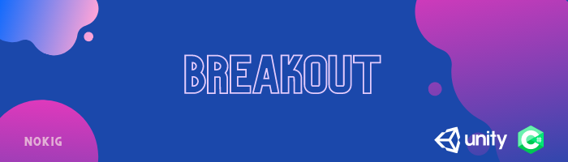

<h1 align="center">
  
  
 

  </h1>
<h3 align="center">  
  
  My first Unity & C# project, A classic Breakout game clone.
  </h3>
  
## Table Of Content

- [General](#general)
- [Installation](#installation)
- [Screenshots](#screenshots)
- [Credits](#credits)  

## General

The game was created as part of "Game Development Foundations course" by [NotSlot](https://github.com/notslot) within my Computer Science B.Sc.

## Installation

- Windows:      
  - &emsp; Download the [WindowsBuild](https://github.com/ArnonGuttel/Breakout/tree/main/WindowsBuild) folder 
  - &emsp; Run the Breakout.exe executable file.
 
 - Mac
   - &emsp; Download the [MacBuild](https://github.com/ArnonGuttel/Breakout/tree/main/MacBuild.app/Contents) folder 
   - &emsp; Run the  Mac Build.app_ package

## Screenshots

  <h3>Game start:</h3>
  
  <h3>Maximum ball speed:</h3>
  
  <h3>Game over:</h3>
  
  
## Credits 
- Sprites - [OpenGameArt](https://opengameart.org/content/breakout-brick-breaker-tile-set-free)
